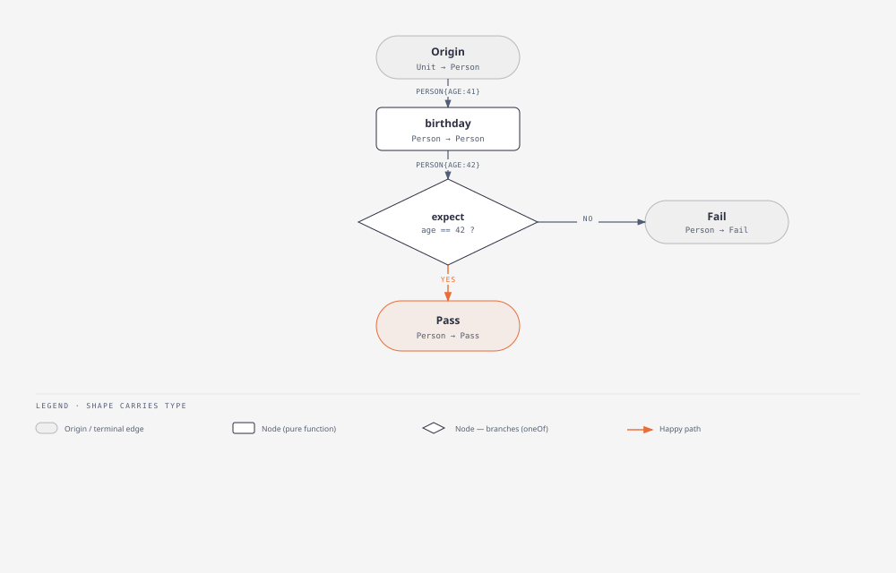

# Weir

Weir is a declarative framework for building applications out of two things: 

* **edges**, pure data schemas
* **nodes**, pure functions from one edge to another

An application is a directed [graph](https://en.wikipedia.org/wiki/Graph_theory) of nodes wired together by their edge types — declared before anything runs, not assembled step by step as it goes.

The name comes from a fish weir: rather than watching the whole ocean, you build the one narrow place everything has to cross, and check it there. Edges are those crossings. Because a node's contract has nothing hidden — its input, its output, nothing else — that checkpoint is something you can compute against, not just something a reviewer hopes got followed. A node that classifies a `Person` doesn't hand back a `Person`; it hands back a `Child`, a `Female`, or a `Male`, so the next node receives the decision as a type instead of re-deriving it. A subgraph with one input and one output looks exactly like a single node from the outside, so graphs nest inside graphs; the nesting bottoms out at a **primitive** — a node whose body is real code instead of more graph.

This matters because most code today gets written with an AI agent's help, and reading a 400-line agent-generated file to decide whether it's correct doesn't scale — you either trust it blind or become the bottleneck. A node here can't hide anything: no classes, no `this`, no state an agent could stash somewhere a reviewer wouldn't think to look. Effects are data too — a node doesn't call out to a database, it returns "I want to fetch this," and the runtime is the only thing that actually performs it. That means the whole history of what a program did is just the log of edges it produced; the tables an app shows you are computed from that log, not the other way around — and both the tables and a node's implementation can be thrown away and rebuilt from it.

Tests live in the node definition, in the same syntax used to wire nodes together:

```
Person { age: 41 } | birthday | expect Person { age: 42 }
```



Because a node's input and output are fully typed, that same type doubles as a way to generate test cases automatically, the way property-based testing tools already do — so a rule like "birthday always adds exactly one year" costs about as much to write as one example, and rules out far more. The types bound what an agent's implementation can do; a rule like that pins down what it must do; the graph itself stays something a human decided, not something generated.

## Status

Early. Nothing works yet.

See [`docs/design.md`](docs/design.md) for the current-state spec — including the formal notation and vocabulary trimmed out of this page — [`docs/design-history.md`](docs/design-history.md) for how it was arrived at, [`docs/getting-started.md`](docs/getting-started.md) for the build order, and [`docs/open-questions.md`](docs/open-questions.md) for what's still unresolved.

If this rhymes with something you're already thinking about, I'd like to hear from you — that's most of the reason this is public at all.
